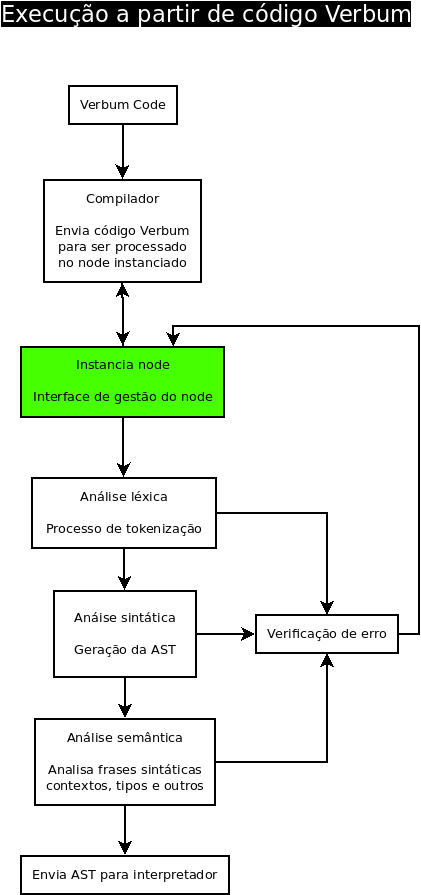
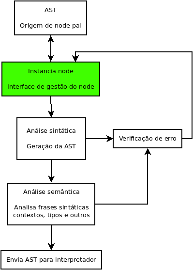
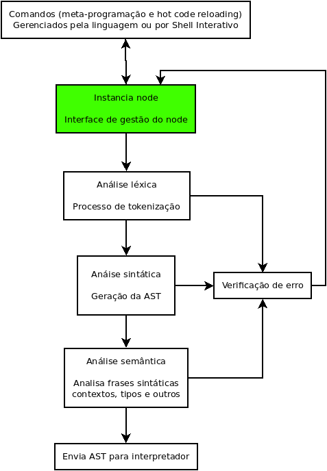

### :arrow_right: Verbum Programming Language ^_^

Uma linguagem de programação desenvolvida com o propósito de ser utilizada principalmente para implementação de sistemas distribuídos.
Atualmente a linguagem encontra-se em desenvolvimento da primeira versão, e não possui ainda uma versão release.

A meta da Verbum é suportar os seguintes conceitos:

- Programação orientada a objetos
- Computação distribuída
- Computação concorrente
- Meta-programação
- Hot code reloading
- Multi-plataforma
- Alta tolerância a falhas
- Escalabilidade horizontal

---

### Descrição geral do fluxo de execução do código Verbum no interpretador

 

#### Execução a partir de código Verbum

    

 

#### Execução a partir de AST compartilhada por node pai

    

 

#### Execução a partir de Shell interativo, ou recursos da linguagem

    

